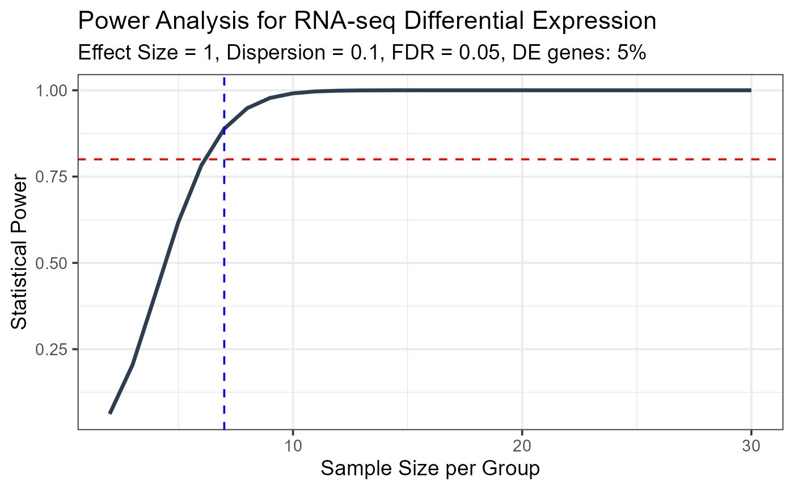
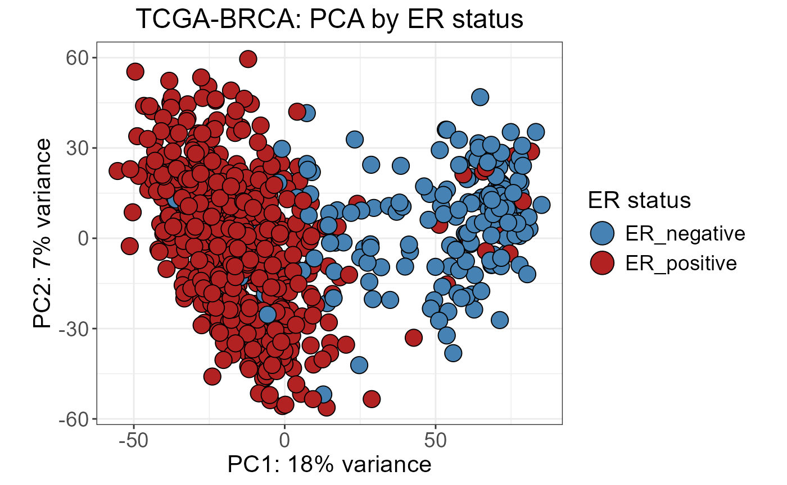
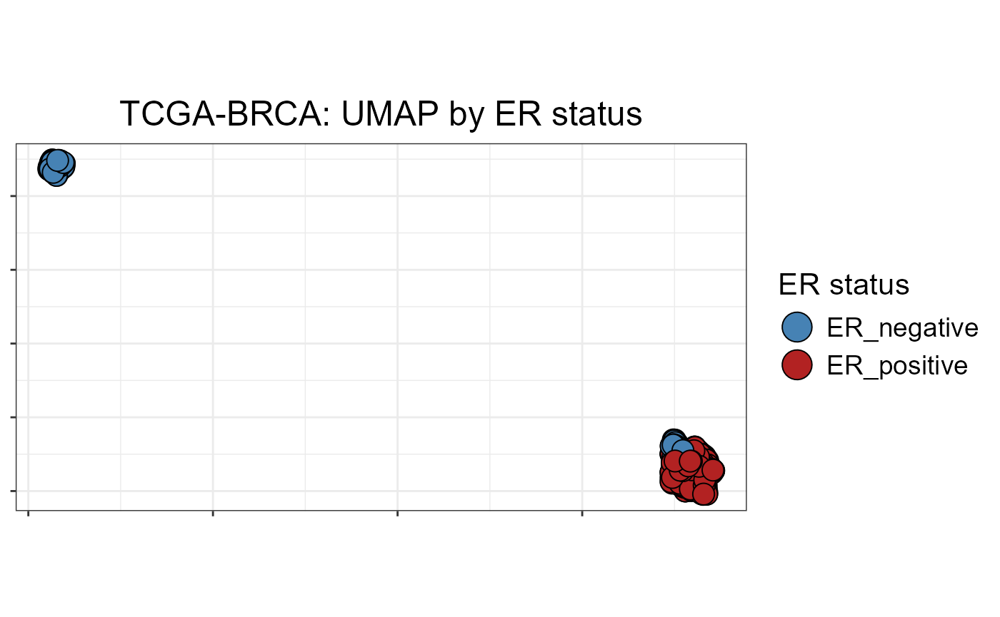
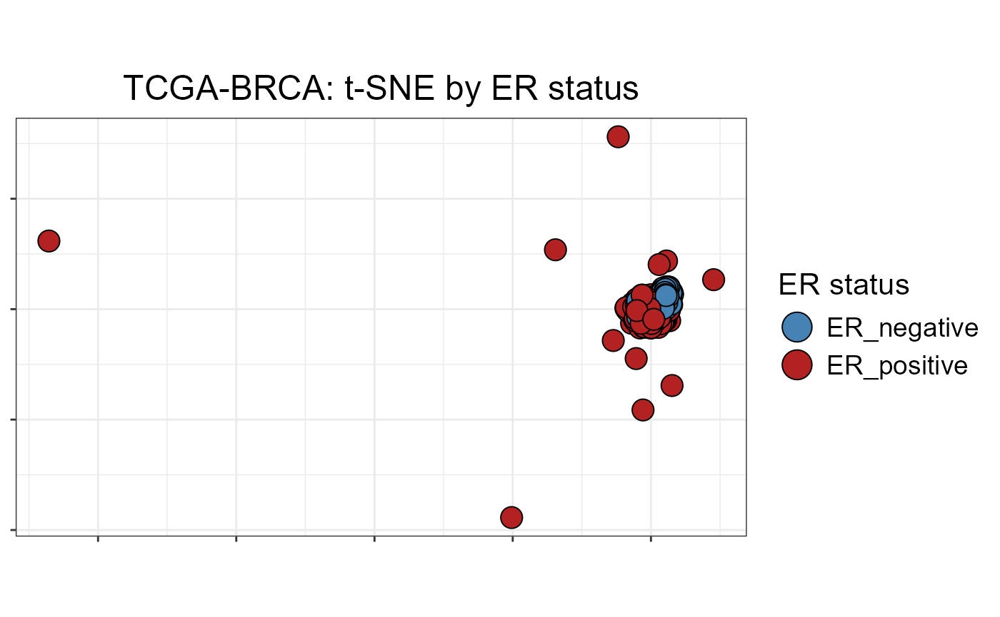

# TCGA-BRCA RNA & RPPA: Differential Expression, Concordance and Visualization

``` r

library(OmicsKit)

data(brca_metadata)
data(brca_rna_dea_er_pos_vs_er_neg)
data(brca_rna_dea_tumor_vs_normal)
data(brca_rna_metadata_er_shared)
data(brca_rna_metadata_tumor_normal)
data(brca_rna_vst_or_logexpr_small)
data(brca_rna_expr_er_shared_filtered)
data(brca_rna_expr_tumor_normal_filtered)
data(brca_rppa_dea_gene_er_pos_vs_er_neg)
data(brca_rppa_expr_gene_er_shared)
data(brca_concordance_rna_rppa_er)
data(brca_crosslayercorr_rna_rppa_er)
```

These package objects are TCGA-BRCA-derived examples prepared from UCSC
Xena data. The RNA-seq objects were derived from log2-normalized TCGA
HiSeqV2 expression matrices, while RPPA examples were generated from the
TCGA RPPA matrix with explicit protein-feature-to-gene mappings.
Differential-expression tables, compact expression matrices, concordance
summaries, and pre-rendered figures are shipped with OmicsKit so that
this vignette does not download data or read raw files at build time.
PNG figures are displayed from `vignettes/figures/`, and the displayed
code also writes PDF companions to the same folder when run
interactively.

## 1. Power Analysis

Power analysis is a useful first check before running a large
differential-expression analysis. TCGA-BRCA includes roughly 1100 tumor
samples and 113 adjacent normal samples, but the analysis still tests
about 20,000 genes simultaneously. Bulk RNA-seq studies often show
biological dispersion near 0.1, so even a well-powered cohort needs
multiple-testing correction in mind. Here we estimate the minimum
per-group sample size needed to detect a log2 fold-change of 1 at 80%
power.

``` r

pa_result <- power_analysis(
  effect_size  = 1,       # log2FC = 1 detectable minimum
  dispersion   = 0.1,     # typical bulk RNA-seq biological variance
  n_genes      = 20000,
  prop_de      = 0.05,    # ~5% DE expected
  alpha        = 0.05,
  power_target = 0.8,
  max_n        = 30,
  plot         = TRUE
)

cat("Minimum samples per group needed:", pa_result$min_sample_size, "\n")
#> Minimum samples per group needed: 7
pa_result$plot
```



``` r

ggplot2::ggsave("vignettes/figures/power_analysis.png",
       pa_result$plot, width = 8, height = 5, dpi = 150)

grDevices::pdf("vignettes/figures/power_analysis.pdf",
               width = 8, height = 5)
print(pa_result$plot)
grDevices::dev.off()
```


Power analysis for a bulk RNA-seq differential-expression workflow with
TCGA-BRCA-like assumptions.

With TCGA-BRCA we have N \>\> minimum required, giving high power to
detect even modest fold-changes.

## 2. Unsupervised Expression Visualization

The object `brca_rna_vst_or_logexpr_small` contains the top 1000 most
variable genes from the ER-positive vs ER-negative RNA-seq matrix. This
compact matrix is suitable for PCA, UMAP, and t-SNE examples without
shipping a full expression matrix in the vignette. The
dimensionality-reduction helpers join annotations by an `"id"` column,
so the sample barcodes are copied from row names before plotting.

### 2.1 PCA

``` r

metadata_dim        <- brca_rna_metadata_er_shared
metadata_dim$id     <- rownames(metadata_dim)

p_pca <- nice_PCA(
  object        = brca_rna_vst_or_logexpr_small,
  annotations   = metadata_dim,
  variables     = c(fill = "ER_group"),
  legend_names  = c(fill = "ER status"),
  colors        = c("steelblue", "firebrick"),
  shapes        = c(21, 21),
  title         = "TCGA-BRCA: PCA by ER status"
)
p_pca
```



``` r

ggplot2::ggsave("vignettes/figures/brca_pca_rna_er_status.png",
       p_pca, width = 7, height = 5, dpi = 150)

grDevices::pdf("vignettes/figures/brca_pca_rna_er_status.pdf",
               width = 7, height = 5)
print(p_pca)
grDevices::dev.off()
```


PCA of top-1000 variable genes from TCGA-BRCA RNA-seq, colored by ER
status.

### 2.2 UMAP

``` r

metadata_dim        <- brca_rna_metadata_er_shared
metadata_dim$id     <- rownames(metadata_dim)

p_umap <- nice_UMAP(
  object        = brca_rna_vst_or_logexpr_small,
  annotations   = metadata_dim,
  variables     = c(fill = "ER_group"),
  legend_names  = c(fill = "ER status"),
  colors        = c("steelblue", "firebrick"),
  shapes        = c(21, 21),
  seed          = 2025,
  title         = "TCGA-BRCA: UMAP by ER status"
)
p_umap
```



``` r

ggplot2::ggsave("vignettes/figures/brca_umap_rna_er_status.png",
       p_umap, width = 7, height = 5, dpi = 150)

grDevices::pdf("vignettes/figures/brca_umap_rna_er_status.pdf",
               width = 7, height = 5)
print(p_umap)
grDevices::dev.off()
```


UMAP of top-1000 variable genes from TCGA-BRCA RNA-seq, colored by ER
status.

### 2.3 t-SNE

``` r

metadata_dim        <- brca_rna_metadata_er_shared
metadata_dim$id     <- rownames(metadata_dim)

p_tsne <- nice_tSNE(
  object        = brca_rna_vst_or_logexpr_small,
  annotations   = metadata_dim,
  variables     = c(fill = "ER_group"),
  legend_names  = c(fill = "ER status"),
  colors        = c("steelblue", "firebrick"),
  shapes        = c(21, 21),
  seed          = 2025,
  title         = "TCGA-BRCA: t-SNE by ER status"
)
p_tsne
```



``` r

ggplot2::ggsave("vignettes/figures/brca_tsne_rna_er_status.png",
       p_tsne, width = 7, height = 5, dpi = 150)

grDevices::pdf("vignettes/figures/brca_tsne_rna_er_status.pdf",
               width = 7, height = 5)
print(p_tsne)
grDevices::dev.off()
```


t-SNE of top-1000 variable genes from TCGA-BRCA RNA-seq, colored by ER
status.

## 3. ER-positive vs ER-negative Comparison

The ER-positive vs ER-negative comparison uses primary tumor samples
only. The contrast is `ER_positive - ER_negative` from a limma workflow,
so `logFC > 0` means higher abundance in ER-positive tumors. RNA-seq and
RPPA results are summarized separately because RNA and protein dynamic
ranges differ.

``` r

er_sig <- sum(brca_rna_dea_er_pos_vs_er_neg$padj < 0.05, na.rm = TRUE)
rp_sig <- sum(brca_rppa_dea_gene_er_pos_vs_er_neg$padj < 0.05, na.rm = TRUE)

data.frame(
  layer      = c("RNA-seq", "RPPA"),
  n_features = c(
    nrow(brca_rna_dea_er_pos_vs_er_neg),
    nrow(brca_rppa_dea_gene_er_pos_vs_er_neg)
  ),
  n_FDR_lt_0.05 = c(er_sig, rp_sig)
)
#>     layer n_features n_FDR_lt_0.05
#> 1 RNA-seq      18129         13974
#> 2    RPPA        153           103
```

``` r

table(brca_rna_metadata_er_shared$ER_group)
#> 
#> ER_negative ER_positive 
#>         179         601
```

## 4. Gene Annotations

[`get_annotations()`](https://danielgarbozo.github.io/OmicsKit/reference/get_annotations.md)
queries Ensembl BioMart, here shown for Ensembl v112, and
[`add_annotations()`](https://danielgarbozo.github.io/OmicsKit/reference/add_annotations.md)
joins the annotation table to the differential-expression result using
gene IDs as keys. This section is not evaluated during vignette builds
because it requires internet access and BioMart queries can be slow or
temporarily unavailable. The shipped object
`brca_rna_dea_er_pos_vs_er_neg` already contains a `gene_symbol` column
precomputed from this workflow.

``` r

# Step 1: fetch annotations for genes in ER DEA (eval = FALSE)
er_gene_ids <- brca_rna_dea_er_pos_vs_er_neg$gene_id

annotations <- get_annotations(
  ensembl_ids = er_gene_ids,
  species     = "hsapiens_gene_ensembl",
  version     = "112",
  mode        = "genes",
  filename    = NULL          # return data frame, do not write file
)

# Step 2: join symbol and biotype to DEA table
brca_rna_dea_er_annotated <- add_annotations(
  object    = brca_rna_dea_er_pos_vs_er_neg,
  reference = annotations,
  variables = c("symbol", "biotype", "chromosome")
)

head(brca_rna_dea_er_annotated[, c("gene_id", "symbol", "logFC", "padj")])
```

## 5. Filtering Genes by Expression Detectability and Trend

[`detect_filter()`](https://danielgarbozo.github.io/OmicsKit/reference/detect_filter.md)
identifies genes that are actually expressed above baseMean and
mean-count thresholds in the groups of interest. This prevents reporting
genes that are technically significant but biologically undetectable.
[`trend_filter()`](https://danielgarbozo.github.io/OmicsKit/reference/trend_filter.md)
is complementary: for paired or ordered comparisons it checks that the
fold-change direction is patient-level consistent, removing genes that
are significant mainly because of a few outlier patients. Both functions
are shown with `eval = FALSE` because
[`trend_filter()`](https://danielgarbozo.github.io/OmicsKit/reference/trend_filter.md)
requires validated paired tumor-normal relationships and full-size
expression matrices. Run these examples only after confirming that the
metadata and expression matrices use the same sample identifiers.

### 5.1 detect_filter

``` r

# detect_filter requires a column named "ensembl" in the DEA results
res_tn <- brca_rna_dea_tumor_vs_normal
colnames(res_tn)[colnames(res_tn) == "gene_id"] <- "ensembl"
rownames(res_tn) <- res_tn$ensembl

# Get sample IDs per group from metadata
samples_normal <- rownames(brca_rna_metadata_tumor_normal)[
  brca_rna_metadata_tumor_normal$rna_tumor_normal == "Normal"
]
samples_tumor <- rownames(brca_rna_metadata_tumor_normal)[
  brca_rna_metadata_tumor_normal$rna_tumor_normal == "Tumor"
]

detected <- detect_filter(
  norm.counts        = as.data.frame(brca_rna_expr_tumor_normal_filtered),
  df.BvsA            = res_tn,
  samples.baseline   = samples_normal,
  samples.condition1 = samples_tumor,
  cutoffs            = c(50, 50, 0)
)

cat("Total detectable genes:", length(detected$DetectGenes), "\n")
head(detected$Comparison1)
```

### 5.2 trend_filter

> **Note:**
> [`trend_filter()`](https://danielgarbozo.github.io/OmicsKit/reference/trend_filter.md)
> is designed for paired/ordered comparisons where patient-level pairing
> has been validated. The Tumor vs Normal example requires confirmed
> patient-level pairing. Run this only after validating your metadata.

``` r

# Requires validated patient-level pairing in metadata
# The gene.col and lfc.col must match columns in the results data frame
tn_metadata <- brca_rna_metadata_tumor_normal
tn_metadata$sample_id <- rownames(tn_metadata)
tn_metadata$patient_id <- tn_metadata$patient

trend_res <- trend_filter(
  expr       = brca_rna_expr_tumor_normal_filtered,
  sampledata = tn_metadata,
  results    = list(Tumor_vs_Normal = res_tn),
  baseline   = "Normal",
  conditions = c(Tumor_vs_Normal = "Tumor"),
  sample.col  = "sample_id",
  patient.col = "patient_id",
  group.col   = "rna_tumor_normal",
  gene.col    = "ensembl",
  lfc.col     = "logFC",
  scale       = "log2"
)

# Genes retained after trend consistency filter
cat("Trend-consistent genes:", length(trend_res$filtered_genes), "\n")
```

## 6. Saving Top Marker Tables

[`save_results()`](https://danielgarbozo.github.io/OmicsKit/reference/save_results.md)
exports three `.xlsx` files from a DEA data frame: all genes,
upregulated markers, and downregulated markers. This makes it easy to
share marker tables with collaborators. The example is shown with
`eval = FALSE` because it writes files to disk.

``` r

# Save ER+ vs ER- RNA-seq top markers (eval = FALSE)
save_results(
  df           = brca_rna_dea_er_pos_vs_er_neg,
  name         = "BRCA_RNA_ER_pos_vs_ER_neg",
  l2fc         = 1,
  cutoff_alpha = 0.05
)
# Creates:
#   BRCA_RNA_ER_pos_vs_ER_neg_full.xlsx
#   BRCA_RNA_ER_pos_vs_ER_neg_up_log2FC>1_FDR<0.05.xlsx
#   BRCA_RNA_ER_pos_vs_ER_neg_down_log2FC<1_FDR<0.05.xlsx

# Save RPPA top markers
save_results(
  df           = brca_rppa_dea_gene_er_pos_vs_er_neg,
  name         = "BRCA_RPPA_ER_pos_vs_ER_neg",
  l2fc         = 0.2,
  cutoff_alpha = 0.05
)
```

## 7. Volcano Plots

[`nice_Volcano()`](https://danielgarbozo.github.io/OmicsKit/reference/nice_Volcano.md)
displays genome-wide differential results with automatic labeling of top
hits, triangle markers for extreme p-values, and color coding for
upregulated, downregulated, and non-significant genes. We show three
volcanoes: RNA-seq Tumor vs Normal, RNA-seq ER-positive vs ER-negative,
and RPPA ER-positive vs ER-negative. Each plotting call is shown as
`eval = FALSE` code followed by a prerendered figure. `y_max = 15` is
used for all three volcano calls; the RPPA volcano uses a smaller
`x_range` and `cutoff_x` because RPPA fold-changes are compressed
relative to RNA-seq.

### 7.1 RNA-seq: Tumor vs Normal

``` r

p_vol_tn <- nice_Volcano(
  results   = brca_rna_dea_tumor_vs_normal,
  x_var     = "logFC",
  y_var     = "padj",
  label_var = "gene_symbol",
  title     = "RNA-seq: Tumor vs Normal",
  cutoff_y  = 0.05,
  cutoff_x  = 1,
  x_range   = 10,
  y_max     = 15
)
ggplot2::ggsave("vignettes/figures/brca_volcano_rna_tumor_vs_normal.png",
       p_vol_tn, width = 8, height = 6, dpi = 150)

grDevices::pdf("vignettes/figures/brca_volcano_rna_tumor_vs_normal.pdf",
               width = 8, height = 6)
print(p_vol_tn)
grDevices::dev.off()
```


RNA-seq DEA Tumor vs Normal. Positive logFC = higher in tumor. Triangles
indicate FDR \< 10^-15.

### 7.2 RNA-seq: ER+ vs ER-

``` r

p_vol_er_rna <- nice_Volcano(
  results   = brca_rna_dea_er_pos_vs_er_neg,
  x_var     = "logFC",
  y_var     = "padj",
  label_var = "gene_symbol",
  title     = "RNA-seq: ER-positive vs ER-negative",
  cutoff_y  = 0.05,
  cutoff_x  = 1,
  x_range   = 10,
  y_max     = 15
)
ggplot2::ggsave("vignettes/figures/brca_volcano_rna_er_pos_vs_er_neg.png",
       p_vol_er_rna, width = 8, height = 6, dpi = 150)

grDevices::pdf("vignettes/figures/brca_volcano_rna_er_pos_vs_er_neg.pdf",
               width = 8, height = 6)
print(p_vol_er_rna)
grDevices::dev.off()
```


RNA-seq DEA ER-positive vs ER-negative primary tumors. Top ER-associated
markers (ESR1, PGR, GATA3) appear as strongly upregulated in ER+.

### 7.3 RPPA: ER+ vs ER-

``` r

p_vol_er_rppa <- nice_Volcano(
  results   = brca_rppa_dea_gene_er_pos_vs_er_neg,
  x_var     = "logFC",
  y_var     = "padj",
  label_var = "gene",
  title     = "RPPA: ER-positive vs ER-negative",
  cutoff_y  = 0.05,
  cutoff_x  = 0.20,
  x_range   = 2,
  y_max     = 15
)
ggplot2::ggsave("vignettes/figures/brca_volcano_rppa_er_pos_vs_er_neg.png",
       p_vol_er_rppa, width = 8, height = 6, dpi = 150)

grDevices::pdf("vignettes/figures/brca_volcano_rppa_er_pos_vs_er_neg.pdf",
               width = 8, height = 6)
print(p_vol_er_rppa)
grDevices::dev.off()
```


RPPA DEA ER-positive vs ER-negative. logFC scale is compressed vs
RNA-seq; cutoff_x = 0.20 reflects RPPA dynamic range.

## 8. RNA–RPPA Cross-Layer Concordance

Integrating RNA-seq and RPPA data for the same comparison allows us to
assess transcription-to-protein concordance. Genes concordant in both
layers provide stronger evidence of true biological change. OmicsKit
provides three complementary functions:
[`concordanceDE()`](https://danielgarbozo.github.io/OmicsKit/reference/concordanceDE.md)
classifies genes into concordant, discordant, only_x, only_y, and
not_significant categories and computes a concordance score.
[`crossLayerCorr()`](https://danielgarbozo.github.io/OmicsKit/reference/crossLayerCorr.md)
computes sample-level Spearman correlations between the two omics layers
using the most variable shared features.
[`nice_ConcordanceScatter()`](https://danielgarbozo.github.io/OmicsKit/reference/nice_ConcordanceScatter.md)
visualizes the logFC-logFC relationship between layers.

### 8.1 concordanceDE

The package includes the precomputed output of
[`concordanceDE()`](https://danielgarbozo.github.io/OmicsKit/reference/concordanceDE.md)
as `brca_concordance_rna_rppa_er`.

``` r

# The object is already the output of concordanceDE()
# Explore the concordance summary
brca_concordance_rna_rppa_er$summary
#> 
#>      concordant      discordant          only_x          only_y not_significant 
#>              20               0               9              32              88

cat("Concordance score (RNA vs RPPA, ER comparison):",
    brca_concordance_rna_rppa_er$concordance_score, "\n")
#> Concordance score (RNA vs RPPA, ER comparison): 1

cat("Shared genes:", brca_concordance_rna_rppa_er$n_shared_genes, "\n")
#> Shared genes: 149
cat("Both significant:", brca_concordance_rna_rppa_er$n_both_significant, "\n")
#> Both significant: 20
```

``` r

# How the concordance object was generated (eval = FALSE, for reference)
# NOTE: both tables are standardized to a shared `gene` column first.
rna_de_for_concordance <- brca_rna_dea_er_pos_vs_er_neg
rna_de_for_concordance$gene <- rna_de_for_concordance$gene_symbol

rppa_de_for_concordance <- brca_rppa_dea_gene_er_pos_vs_er_neg

brca_concordance_rna_rppa_er <- concordanceDE(
  de_x            = rna_de_for_concordance,
  de_y            = rppa_de_for_concordance,
  gene_col        = "gene",
  logfc_col       = "logFC",
  padj_col        = "padj",
  padj_threshold  = c(0.05, 0.05),
  logfc_threshold = c(1, 0.20)
)
```

### 8.2 crossLayerCorr

``` r

# Precomputed crossLayerCorr output
cat("Median Spearman r (RNA vs RPPA, ER samples):",
    brca_crosslayercorr_rna_rppa_er$median_r, "\n")
#> Median Spearman r (RNA vs RPPA, ER samples): 0.2337794

cat("Shared samples:", brca_crosslayercorr_rna_rppa_er$n_shared_samples, "\n")
#> Shared samples: 637
cat("Features used:", brca_crosslayercorr_rna_rppa_er$n_features_used, "\n")
#> Features used: 146
```

``` r

# How the crossLayerCorr object was generated (eval = FALSE, for reference)
brca_crosslayercorr_rna_rppa_er <- crossLayerCorr(
  mat_x  = brca_rna_expr_er_shared_filtered,
  mat_y  = brca_rppa_expr_gene_er_shared,
  method = "spearman",
  top_n  = 500,
  plot   = TRUE
)
```

``` r

# Plot from the crossLayerCorr workflow (eval = FALSE)
brca_crosslayercorr_rna_rppa_er_plot <- crossLayerCorr(
  mat_x  = brca_rna_expr_er_shared_filtered,
  mat_y  = brca_rppa_expr_gene_er_shared,
  method = "spearman",
  top_n  = 500,
  plot   = TRUE
)

p_crosslayer <- brca_crosslayercorr_rna_rppa_er_plot$plot

ggplot2::ggsave(
  "vignettes/figures/CrossLayerCorr_RNAseq_RPPA_samples.png",
  p_crosslayer,
  width = 10, height = 5, dpi = 150
)

grDevices::pdf("vignettes/figures/CrossLayerCorr_RNAseq_RPPA_samples.pdf",
               width = 10, height = 5)
print(p_crosslayer)
grDevices::dev.off()
```


Sample-level Spearman correlation between RNA-seq and RPPA expression
profiles in TCGA-BRCA ER-comparison samples. Dashed line = median r.
Sorted by decreasing correlation.

### 8.3 nice_ConcordanceScatter

``` r

p_conc <- nice_ConcordanceScatter(
  concordance_result = brca_concordance_rna_rppa_er,
  x_label            = "log2FC (RNA-seq)",
  y_label            = "log2FC (RPPA)",
  genes_label        = c("ESR1", "PGR", "GATA3", "ERBB2", "EGFR",
                         "MKI67", "CDH1", "AR")
)
ggplot2::ggsave(
  "vignettes/figures/ConcordanceScatter_RNAseq_RPPA_ERpositive_vs_ERnegative.png",
  p_conc, width = 7, height = 7, dpi = 150
)

grDevices::pdf(
  "vignettes/figures/ConcordanceScatter_RNAseq_RPPA_ERpositive_vs_ERnegative.pdf",
  width = 7, height = 7
)
print(p_conc)
grDevices::dev.off()
```


Concordance scatter plot: RNA-seq vs RPPA logFC for ER+ vs ER-
comparison. Concordant genes (same direction in both layers) are shown
in teal, discordant in orange. Key ER-associated genes are labeled.

## 9. Gene-level Expression: Violin-Scatter-Box Plots

[`nice_VSB()`](https://danielgarbozo.github.io/OmicsKit/reference/nice_VSB.md)
displays per-gene expression across sample groups by combining violin,
scatter, and box layers.
[`get_stars()`](https://danielgarbozo.github.io/OmicsKit/reference/get_stars.md)
returns a significance string such as `"***"` from a DEA results object
for a given gene, enabling annotation of comparisons. We show
biologically relevant BRCA markers: **ESR1**, the master regulator of ER
signaling and a strong ER-positive RNA marker; **PGR**, a progesterone
receptor marker co-expressed with ESR1 in luminal tumors; **GATA3**, a
luminal transcription factor and robust ER-positive marker; and
**ERBB2**, the HER2 protein measured by RPPA. Because the current
[`nice_VSB()`](https://danielgarbozo.github.io/OmicsKit/reference/nice_VSB.md)
implementation uses `sample_type` for the x-axis, the plotting
annotations below copy `ER_group` into `sample_type` while preserving
`ER_group` for point color.
[`nice_VSB()`](https://danielgarbozo.github.io/OmicsKit/reference/nice_VSB.md)
also log2-transforms the supplied matrix internally, so the displayed
code applies a plot-only positive shift when a normalized matrix
contains zero or negative values.

### 9.1 ESR1 - RNA-seq

``` r

# Prepare DEA for get_stars (needs "ensembl" column)
er_res_for_stars <- brca_rna_dea_er_pos_vs_er_neg
colnames(er_res_for_stars)[colnames(er_res_for_stars) == "gene_symbol"] <- "ensembl"

stars_ESR1 <- get_stars(
  geneID = "ESR1",
  object = er_res_for_stars
)

vsb_rna_expr <- brca_rna_expr_er_shared_filtered
if (min(vsb_rna_expr, na.rm = TRUE) <= 0) {
  vsb_rna_expr <- vsb_rna_expr - min(vsb_rna_expr, na.rm = TRUE) + 1e-3
}

vsb_annotations_rna <- brca_rna_metadata_er_shared[
  colnames(vsb_rna_expr), , drop = FALSE
]
vsb_annotations_rna$sample_type <- vsb_annotations_rna$ER_group

p_vsb_esr1 <- nice_VSB(
  object      = vsb_rna_expr,
  annotations = vsb_annotations_rna,
  variables   = c(fill = "ER_group"),
  genename    = "ESR1",
  symbol      = paste0("(", stars_ESR1, ")"),
  categories  = c("ER_negative", "ER_positive"),
  labels      = c("ER-", "ER+"),
  colors      = c("steelblue", "firebrick"),
  shapes      = 21,
  markersize  = 3
)

ggplot2::ggsave("vignettes/figures/brca_vsb_rna_ESR1.png",
       p_vsb_esr1, width = 6, height = 5, dpi = 150)

grDevices::pdf("vignettes/figures/brca_vsb_rna_ESR1.pdf",
               width = 6, height = 5)
print(p_vsb_esr1)
grDevices::dev.off()
```


ESR1 RNA-seq expression (log2 normalized counts) across ER-negative and
ER-positive TCGA-BRCA primary tumors. ESR1 is the direct target of ER
signaling and the most discriminant marker in this comparison.

### 9.2 PGR - RNA-seq

``` r

stars_PGR <- get_stars(geneID = "PGR", object = er_res_for_stars)

p_vsb_pgr <- nice_VSB(
  object      = vsb_rna_expr,
  annotations = vsb_annotations_rna,
  variables   = c(fill = "ER_group"),
  genename    = "PGR",
  symbol      = paste0("(", stars_PGR, ")"),
  categories  = c("ER_negative", "ER_positive"),
  labels      = c("ER-", "ER+"),
  colors      = c("steelblue", "firebrick"),
  shapes      = 21,
  markersize  = 3
)

ggplot2::ggsave("vignettes/figures/brca_vsb_rna_PGR.png",
       p_vsb_pgr, width = 6, height = 5, dpi = 150)

grDevices::pdf("vignettes/figures/brca_vsb_rna_PGR.pdf",
               width = 6, height = 5)
print(p_vsb_pgr)
grDevices::dev.off()
```


PGR (progesterone receptor) RNA-seq expression in TCGA-BRCA. PGR is a
luminal marker co-expressed with ESR1 and part of the canonical ER+ gene
program.

### 9.3 GATA3 - RNA-seq

``` r

stars_GATA3 <- get_stars(geneID = "GATA3", object = er_res_for_stars)

p_vsb_gata3 <- nice_VSB(
  object      = vsb_rna_expr,
  annotations = vsb_annotations_rna,
  variables   = c(fill = "ER_group"),
  genename    = "GATA3",
  symbol      = paste0("(", stars_GATA3, ")"),
  categories  = c("ER_negative", "ER_positive"),
  labels      = c("ER-", "ER+"),
  colors      = c("steelblue", "firebrick"),
  shapes      = 21,
  markersize  = 3
)

ggplot2::ggsave("vignettes/figures/brca_vsb_rna_GATA3.png",
       p_vsb_gata3, width = 6, height = 5, dpi = 150)

grDevices::pdf("vignettes/figures/brca_vsb_rna_GATA3.pdf",
               width = 6, height = 5)
print(p_vsb_gata3)
grDevices::dev.off()
```


GATA3 RNA-seq expression in TCGA-BRCA. GATA3 is a luminal transcription
factor and a robust marker of ER-positive breast tumors, also used in
clinical diagnostics.

### 9.4 ERBB2 - RPPA protein level

``` r

# RPPA get_stars: use RPPA DEA table
rppa_res_for_stars <- brca_rppa_dea_gene_er_pos_vs_er_neg
colnames(rppa_res_for_stars)[colnames(rppa_res_for_stars) == "gene"] <- "ensembl"

stars_ERBB2 <- get_stars(geneID = "ERBB2", object = rppa_res_for_stars)

vsb_rppa_expr <- brca_rppa_expr_gene_er_shared
if (min(vsb_rppa_expr, na.rm = TRUE) <= 0) {
  vsb_rppa_expr <- vsb_rppa_expr - min(vsb_rppa_expr, na.rm = TRUE) + 1e-3
}

stopifnot("ERBB2" %in% rownames(vsb_rppa_expr))

vsb_annotations_rppa <- brca_rna_metadata_er_shared[
  colnames(vsb_rppa_expr), , drop = FALSE
]
vsb_annotations_rppa$sample_type <- vsb_annotations_rppa$ER_group

p_vsb_erbb2 <- nice_VSB(
  object      = vsb_rppa_expr,
  annotations = vsb_annotations_rppa,
  variables   = c(fill = "ER_group"),
  genename    = "ERBB2",
  symbol      = paste0("RPPA (", stars_ERBB2, ")"),
  categories  = c("ER_negative", "ER_positive"),
  labels      = c("ER-", "ER+"),
  colors      = c("steelblue", "firebrick"),
  shapes      = 21,
  markersize  = 3
)

ggplot2::ggsave("vignettes/figures/brca_vsb_rppa_ERBB2.png",
       p_vsb_erbb2, width = 6, height = 5, dpi = 150)

grDevices::pdf("vignettes/figures/brca_vsb_rppa_ERBB2.pdf",
               width = 6, height = 5)
print(p_vsb_erbb2)
grDevices::dev.off()
```


ERBB2 protein signal (RPPA) across ER-negative and ER-positive TCGA-BRCA
primary tumors. ERBB2 (HER2) amplification occurs in a subset of both ER
groups, generating the bimodal distribution characteristic of this
marker.

## Reproducibility

Package objects and pre-rendered figures are generated by scripts in
`data-raw/brca/`. The vignette does not re-run data preparation to keep
build times short and results reproducible across environments.

``` r

sessionInfo()
#> R version 4.4.2 (2024-10-31 ucrt)
#> Platform: x86_64-w64-mingw32/x64
#> Running under: Windows 11 x64 (build 26200)
#> 
#> Matrix products: default
#> 
#> 
#> locale:
#> [1] LC_COLLATE=English_United States.utf8 
#> [2] LC_CTYPE=English_United States.utf8   
#> [3] LC_MONETARY=English_United States.utf8
#> [4] LC_NUMERIC=C                          
#> [5] LC_TIME=English_United States.utf8    
#> 
#> time zone: America/Bogota
#> tzcode source: internal
#> 
#> attached base packages:
#> [1] stats     graphics  grDevices utils     datasets  methods   base     
#> 
#> other attached packages:
#> [1] OmicsKit_1.0.0.0000
#> 
#> loaded via a namespace (and not attached):
#>  [1] sass_0.4.10         generics_0.1.4      tidyr_1.3.2        
#>  [4] lattice_0.22-6      digest_0.6.39       magrittr_2.0.5     
#>  [7] pROC_1.19.0.1       evaluate_1.0.5      grid_4.4.2         
#> [10] RColorBrewer_1.1-3  fastmap_1.2.0       Matrix_1.7-1       
#> [13] jsonlite_2.0.0      umap_0.2.10.0       RSpectra_0.16-2    
#> [16] backports_1.5.1     survival_3.8-6      purrr_1.2.2        
#> [19] scales_1.4.0        textshaping_1.0.5   jquerylib_0.1.4    
#> [22] cli_3.6.6           rlang_1.2.0         splines_4.4.2      
#> [25] withr_3.0.3         cachem_1.1.0        yaml_2.3.12        
#> [28] otel_0.2.0          tools_4.4.2         dplyr_1.2.1        
#> [31] ggplot2_4.0.3       BiocGenerics_0.52.0 reticulate_1.46.0  
#> [34] broom_1.0.13        tsne_0.2-0          png_0.1-9          
#> [37] vctrs_0.7.3         R6_2.6.1            stats4_4.4.2       
#> [40] lifecycle_1.0.5     S4Vectors_0.44.0    fs_2.1.0           
#> [43] htmlwidgets_1.6.4   ragg_1.5.2          pkgconfig_2.0.3    
#> [46] desc_1.4.3          pkgdown_2.2.0       pillar_1.11.1      
#> [49] bslib_0.10.0        gtable_0.3.6        glue_1.8.1         
#> [52] Rcpp_1.1.1-1.1      systemfonts_1.3.2   xfun_0.54          
#> [55] tibble_3.3.1        tidyselect_1.2.1    rstudioapi_0.18.0  
#> [58] knitr_1.51          dichromat_2.0-0.1   farver_2.1.2       
#> [61] htmltools_0.5.9     patchwork_1.3.2     labeling_0.4.3     
#> [64] rmarkdown_2.31      compiler_4.4.2      S7_0.2.2           
#> [67] askpass_1.2.1       openssl_2.4.2
```
